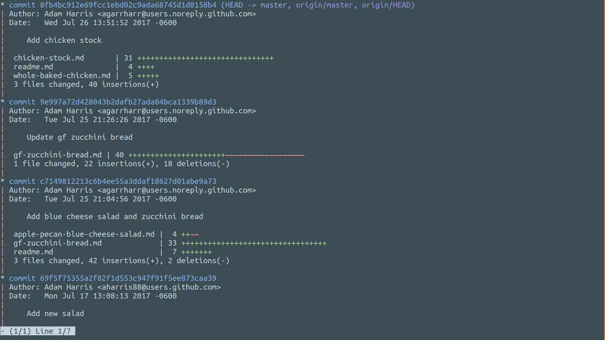

# nova-gnome-terminal

Nova color scheme plugin for GNOME Terminal

## Installation

1. Download the install.sh file.
1. Run `./install.sh Default`

Just replace `Default` with the name of your profile. You can create a new profile by going to Preferences -> Profiles -> New.

## Contributing

See [CONTRIBUTING.md](CONTRIBUTING.md)

## More info

**See the [documentation website](https://trevordmiller.com/projects/nova) for more information**

